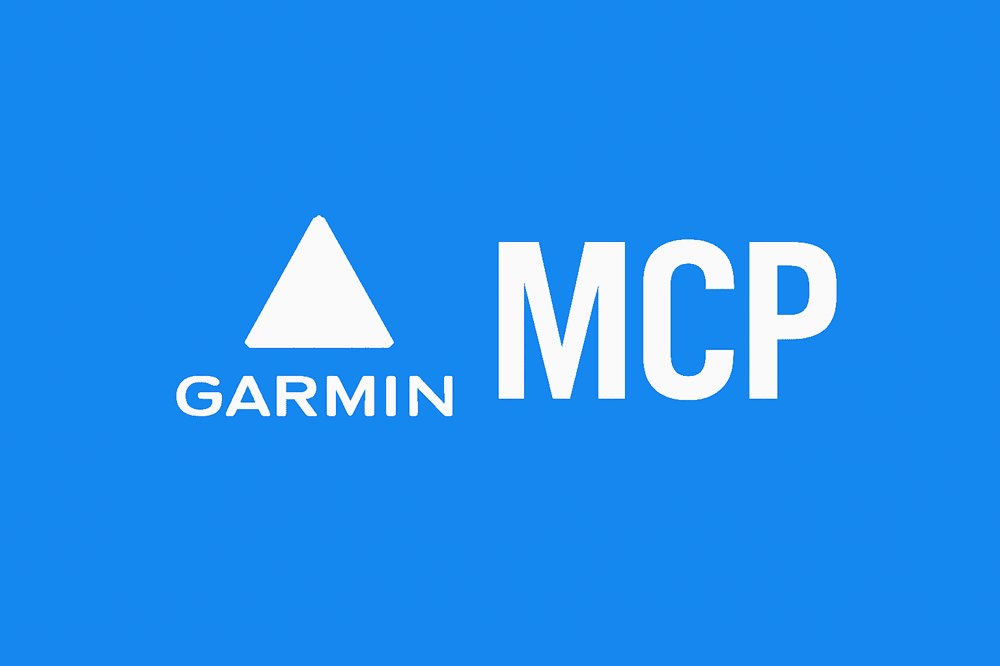

# Garmin Connect MCP Server



A Model Context Protocol (MCP) server for Garmin Connect integration. Access your activities, health data, training metrics, and more through Claude and other LLMs.

[](https://www.python.org/downloads/)

## Overview

This MCP server provides 22 tools to interact with your Garmin Connect account, organized into 8 categories:

- Activities (3 tools) - Query activities and view detailed metrics
- Analysis (2 tools) - Compare activities and find similar workouts
- Health & Wellness (4 tools) - Access health metrics, sleep, heart rate, and activity data
- Training (3 tools) - Analyze training periods and performance trends
- User Profile (1 tool) - Access profile, statistics, and personal records
- Challenges & Goals (2 tools) - Track goals, PRs, badges, and challenges
- Devices & Gear (2 tools) - Manage devices and equipment
- Weight Management (2 tools) - Track weight data
- Other (3 tools) - Workouts, manual data entry, women's health tracking

Additionally, the server provides:

- 3 MCP Resources - Athlete profile, training readiness, and daily health for ongoing context
- 6 MCP Prompts - Templates for common queries (training analysis, sleep quality, readiness checks, activity analysis, run comparison, health summary)

## Prerequisites

- Python 3.11+ and [uv](https://github.com/astral-sh/uv), OR
- Docker

## Installation & Setup

### How Authentication Works

1. Credential Authentication - First run authenticates with email/password
2. MFA Support - If MFA is enabled, you'll be prompted for your code (interactive stdin)
3. Token Storage - OAuth tokens saved to `~/.garminconnect/` and automatically refreshed
4. Persistence - Tokens persist across runs (UV on host, Docker requires volume mount)

### Option 1: Using UV

```bash
# Install dependencies
cd garmin-connect-mcp
uv sync
```

Then configure credentials using one of these methods:

#### Interactive Setup

```bash
uv run garmin-connect-mcp-auth
```

This will prompt for your credentials and save them to `.env`.

#### Manual Setup

Create a `.env` file manually:

```bash
GARMIN_EMAIL=your-email@example.com
GARMIN_PASSWORD=your-password
```

### Option 2: Using Docker

```bash
# Pull the image
docker pull ghcr.io/eddmann/garmin-connect-mcp:latest
```

Then configure credentials using one of these methods:

#### Interactive Setup

```bash
# Create the env file first (Docker will create it as a directory if it doesn't exist)
touch garmin-connect-mcp.env

# Run the setup script
docker run -it --rm \
  -v "/ABSOLUTE/PATH/TO/garmin-connect-mcp.env:/app/.env" \
  --entrypoint= \
  ghcr.io/eddmann/garmin-connect-mcp:latest \
  python -m garmin_connect_mcp.scripts.setup_auth
```

This will prompt for your credentials and save them to `garmin-connect-mcp.env`.

#### Manual Setup

Create a `garmin-connect-mcp.env` file manually in your current directory:

```bash
GARMIN_EMAIL=your-email@example.com
GARMIN_PASSWORD=your-password
```

#### MFA Support for Docker

If you have MFA enabled on your Garmin account:

- The server will prompt for your MFA code on first run (requires `-it` flags for interactive input)
- **Important**: Without token persistence, you'll need to enter your MFA code on every container restart
- **Recommended**: Mount the token directory as a volume to persist tokens and avoid repeated MFA prompts

To persist tokens across Docker runs, create a directory for tokens and mount it:

```bash
# Create token directory on host
mkdir -p ~/.garminconnect-docker

# Then use this directory in your Docker configuration (see Claude Desktop Configuration below)
```

## Claude Desktop Configuration

Add to your configuration file:

- macOS: `~/Library/Application Support/Claude/claude_desktop_config.json`
- Windows: `%APPDATA%\Claude\claude_desktop_config.json`

### Using UV

```json
{
  "mcpServers": {
    "garmin": {
      "command": "uv",
      "args": [
        "run",
        "--directory",
        "/ABSOLUTE/PATH/TO/garmin-connect-mcp",
        "garmin-connect-mcp"
      ]
    }
  }
}
```

### Using Docker

#### Without Token Persistence (MFA required on every restart)

```json
{
  "mcpServers": {
    "garmin": {
      "command": "docker",
      "args": [
        "run",
        "-i",
        "--rm",
        "-v",
        "/ABSOLUTE/PATH/TO/garmin-connect-mcp.env:/app/.env",
        "ghcr.io/eddmann/garmin-connect-mcp:latest"
      ]
    }
  }
}
```

#### With Token Persistence (Recommended for MFA users)

```json
{
  "mcpServers": {
    "garmin": {
      "command": "docker",
      "args": [
        "run",
        "-i",
        "--rm",
        "-v",
        "/ABSOLUTE/PATH/TO/garmin-connect-mcp.env:/app/.env",
        "-v",
        "/ABSOLUTE/PATH/TO/.garminconnect-docker:/root/.garminconnect",
        "ghcr.io/eddmann/garmin-connect-mcp:latest"
      ]
    }
  }
}
```

Replace `/ABSOLUTE/PATH/TO/.garminconnect-docker` with the absolute path to your token directory. On Windows, use something like `C:\\Users\\YOUR_USERNAME\\.garminconnect-docker`.

## Usage

Ask Claude to interact with your Garmin data using natural language. The server provides tools, resources, and prompt templates to help you get started.

### Quick Start with MCP Prompts

Use built-in prompt templates for common queries (available via prompt suggestions in Claude):

- `analyze-recent-training` - Analyze my training over the past 30 days
- `sleep-quality-report` - Analyze sleep quality with recommendations
- `training-readiness-check` - Check if I'm ready to train hard today
- `activity-deep-dive` - Deep dive into a specific activity
- `compare-recent-runs` - Compare recent runs to track progress
- `health-summary` - Show comprehensive health overview

### Activities

```
"Show me my runs from the last 30 days"
"Get details for my half marathon yesterday including splits and heart rate zones"
"Show me the comments on my latest cycling activity"
```

### Training Analysis

```
"Analyze my training over the past 30 days"
"Compare my last three 10K runs"
"Find runs similar to my tempo workout from last week"
```

### Health & Wellness

```
"How did I sleep last night?"
"What's my Body Battery level today?"
"Show me my stress levels and recovery status"
"Am I ready to train hard today?"
```

_Note: The athlete profile resource (`garmin://athlete/profile`) and daily health resource (`garmin://health/today`) automatically provide ongoing context._

### Performance Metrics

```
"What's my VO2 max trend?"
"Show me my training readiness and recent stats"
```

_Note: List-returning tools use cursor-based pagination with default limits (10 items for activities, 7 for health data)._

## Available Tools

### Activities (3 tools)

| Tool                   | Description                                                            |
| ---------------------- | ---------------------------------------------------------------------- |
| `query-activities`     | Query activities with pagination (by ID, date range, or specific date) |
| `get-activity-details` | Get comprehensive activity details (splits, weather, HR zones, gear)   |
| `get-activity-social`  | Get social details for an activity (likes, comments, kudos)            |

### Analysis (2 tools)

| Tool                      | Description                                     |
| ------------------------- | ----------------------------------------------- |
| `compare-activities`      | Compare 2-5 activities side-by-side             |
| `find-similar-activities` | Find activities similar to a reference activity |

### Health & Wellness (4 tools)

| Tool                     | Description                                                                   |
| ------------------------ | ----------------------------------------------------------------------------- |
| `query-health-summary`   | Query daily health summaries with pagination (stats, readiness, Body Battery) |
| `query-sleep-data`       | Query sleep data with stages, scores, and HRV                                 |
| `query-heart-rate-data`  | Query heart rate data with resting HR                                         |
| `query-activity-metrics` | Query activity metrics (steps, stress, respiration, SpO2, etc.)               |

### Training (3 tools)

| Tool                      | Description                                                         |
| ------------------------- | ------------------------------------------------------------------- |
| `analyze-training-period` | Analyze training over a time period with insights                   |
| `get-performance-metrics` | Get performance metrics (VO2 max, hill score, endurance, HRV, etc.) |
| `get-training-effect`     | Get training effect and progress summary                            |

### User Profile (1 tool)

| Tool               | Description                                          |
| ------------------ | ---------------------------------------------------- |
| `get-user-profile` | Get comprehensive athlete profile with stats and PRs |

### Challenges & Goals (2 tools)

| Tool                      | Description                                         |
| ------------------------- | --------------------------------------------------- |
| `query-goals-and-records` | Query goals, personal records, and race predictions |
| `query-challenges`        | Query challenges and badges (by status and type)    |

### Devices & Gear (2 tools)

| Tool            | Description                                                  |
| --------------- | ------------------------------------------------------------ |
| `query-devices` | Query device information (with settings, solar data, alarms) |
| `query-gear`    | Query gear and equipment (with defaults and usage stats)     |

### Weight Management (2 tools)

| Tool                 | Description                         |
| -------------------- | ----------------------------------- |
| `query-weight-data`  | Query weight data for date or range |
| `manage-weight-data` | Add or delete weight entries        |

### Other (3 tools)

| Tool                  | Description                                      |
| --------------------- | ------------------------------------------------ |
| `manage-workouts`     | Workout management (list, get, download, upload) |
| `log-health-data`     | Log body composition, blood pressure, hydration  |
| `query-womens-health` | Query pregnancy and menstrual cycle data         |

## MCP Resources

Resources provide ongoing context to the LLM without requiring explicit tool calls:

| Resource                      | Description                                        |
| ----------------------------- | -------------------------------------------------- |
| `garmin://athlete/profile`    | Athlete profile with stats, zones, and PRs         |
| `garmin://training/readiness` | Current training readiness and Body Battery        |
| `garmin://health/today`       | Today's health snapshot (steps, sleep, stress, HR) |

## MCP Prompts

Prompt templates for common queries (accessible via prompt suggestion in Claude):

| Prompt                     | Description                                         |
| -------------------------- | --------------------------------------------------- |
| `analyze-recent-training`  | Analyze training over a specified period            |
| `sleep-quality-report`     | Sleep quality analysis with recommendations         |
| `training-readiness-check` | Check if ready to train hard today                  |
| `activity-deep-dive`       | Deep dive into a specific activity with all metrics |
| `compare-recent-runs`      | Compare recent runs to identify trends              |
| `health-summary`           | Comprehensive health overview                       |

## License

MIT License - see [LICENSE](LICENSE) file for details

## Disclaimer

This project is not affiliated with, endorsed by, or sponsored by Garmin Ltd. or any of its affiliates. All product names, logos, and brands are property of their respective owners.
